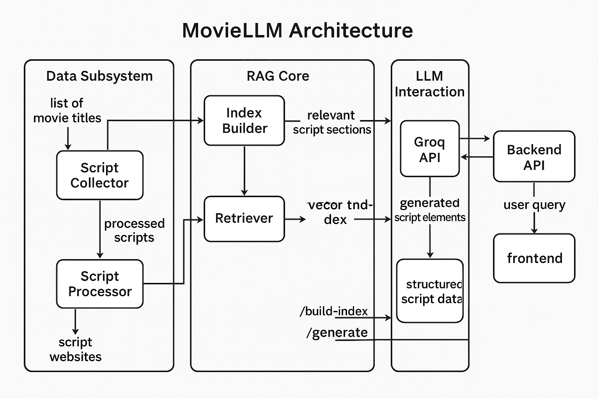

# MovieLLM - AI Movie Script Generator

An advanced AI system that generates movie scripts based on themes using fine-tuned language models and RAG (Retrieval-Augmented Generation).

## Features

- Data collection from multiple movie script sources
- Advanced preprocessing of movie scripts
- Fine-tuned language model for script generation
- RAG system for context-aware generation
- Interactive web interface for script generation and editing

## Project Structure


```
MovieLLM/
├── data/                  # Script data and processed datasets
├── src/
│   ├── data_collection/   # Script scraping and collection
│   ├── preprocessing/     # Data cleaning and tokenization
│   ├── model/            # Model training and fine-tuning
│   ├── rag/              # RAG system implementation
│   └── api/              # FastAPI backend
├── frontend/             # Web interface
└── config/               # Configuration files
```

## Setup

1. Install dependencies:
```bash
pip install -r requirements.txt
```

2. Set up environment variables:
```bash
cp .env.example .env
# Edit .env with your API keys and configuration
```

3. Run the application:
```bash
# Start the backend
uvicorn src.api.main:app --reload

# Start the frontend (in a separate terminal)
cd frontend
npm install
npm start
```

## Usage

1. Access the web interface at `http://localhost:3000`
2. Enter your desired movie theme
3. Generate and customize your movie script
4. Export or save your generated script

## Configuration

- Edit `config/config.yaml` to modify model parameters
- Update `.env` for API keys and environment-specific settings

## License

MIT License 
